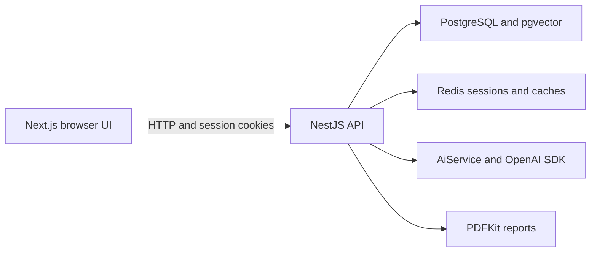

# AI Project Estimator

A Next.js/NestJS workspace for versioned software estimates. Costs are calculated
by the backend; AI supplies features, hours, risks, and technology suggestions.
See [PLAN.md](PLAN.md) for implementation progress and pending acceptance checks.

## Development

Use Node 20+ and pnpm 9.15.0. Install dependencies and create a local environment
with distinct random JWT secrets. `setup:env` preserves an existing `.env`.
Docker Compose provides PostgreSQL with pgvector and Redis for local development.

```sh
pnpm install --frozen-lockfile
pnpm setup:env
docker compose up -d postgres redis
pnpm db:migrate
pnpm dev:api
# In another terminal:
pnpm dev:web
```

The web app runs at http://localhost:3000, the API at http://localhost:4000,
and API documentation at http://localhost:4000/api/docs.
The API loads the root `.env`; database/seed scripts do likewise. The web default
API URL is localhost:4000; custom URLs must be supplied to `dev:web` as
`NEXT_PUBLIC_API_URL`.

## Architecture and deployment



The shared package contains runtime AI schemas and response types. Backend
transactions enforce ownership and immutable versions; decimal arithmetic computes
costs independently of AI. Synchronous provider requests have bounded timeouts and
run outside transactions. AiService keeps a future queue/worker implementation
separate from controllers; jobs, distributed throttling, vector indexes and
non-Latin PDF font fallback are future improvements.

Frontend source uses `content/` for UI copy, `types/` for response/form/component
contracts, `schemas/` for validation, `constants/` for shared defaults and styles,
and `config/` for public environment settings. API environment access and defaults
live in `src/config/`; domain types/constants stay with their modules, error copy
lives in `src/content/`, and AI instructions live in `ai/ai-prompts.ts`.
Private environment values remain backend-only and are never stored in copy files.

For the full container stack, run `pnpm setup:env`, edit `.env` as needed, then
`docker compose up --build`. The one-shot migration service completes before the
API starts; the web service waits for API health. Database data uses a named
volume. Images run as the unprivileged Node user. The browser API URL is baked
into the web build, so changing `NEXT_PUBLIC_API_URL` requires rebuilding.
Docker builds and a fresh-clone startup remain to be verified locally.

## Environment

See [.env.example](.env.example) for defaults. Required API settings are
`DATABASE_URL`, `REDIS_URL`, and distinct `JWT_SECRET`/`JWT_REFRESH_SECRET` values
of at least 32 characters. Startup validates these fields without printing values.
`WEB_ORIGIN` controls the allowed credentialed browser origin; `PORT` defaults to 4000. `COOKIE_SECURE=false` supports local HTTP Compose. Use `true` behind HTTPS
in deployment; production defaults to secure cookies when the setting is absent.
`NEXT_PUBLIC_API_URL` is public; OpenAI and session secrets belong only on the API.
`DEMO_EMAIL` defaults to demo@example.com; set `DEMO_PASSWORD` to at least 12
characters when creating that account. Existing account passwords are preserved.

## AI generation

Set `OPENAI_API_KEY` only on the backend. Optional settings are `OPENAI_MODEL`
(default `gpt-4o-mini`), `OPENAI_TIMEOUT_MS` (default 60000; valid range
1000–120000), and `OPENAI_EMBEDDING_MODEL` (default `text-embedding-3-small`).
Generation fails with a safe error if no key is configured; manual estimates
remain available. The API does not automatically retry provider failures.

Open a project and choose **Generate Estimate**, supplying the hourly rate and
three-letter currency. The backend reads the saved project description and
validates the AI response before creating a version. Review generated assumptions
and hours. Editing hours creates a new version and preserves previous versions.

- `POST /projects/:id/estimates`: AI generation; body `{ "hourlyRate": 50, "currency": "USD" }`.
- `POST /projects/:id/estimates/manual`: manual creation with summary, rate, currency, and features.
- `GET /projects/:id/estimates`: version history.
- `GET /projects/:id/estimates/:estimateId`: version detail.
- `PATCH /projects/:id/estimates/:estimateId/items/:itemId`: create a new version with updated hours.

If requirements change during generation, the API rejects the stale result with
`PROJECT_CHANGED`. Archived projects reject creation and edits. All routes
require authentication and enforce project ownership.

The provider uses strict structured outputs through the Responses API, based on
[official OpenAI documentation](https://developers.openai.com/api/docs/guides/structured-outputs).
The shared `@ape/types` package builds CommonJS runtime schemas for the API and
provides declarations for both apps. API build/dev/test/typecheck scripts build it
first, so direct app commands work in a clean checkout.

## Verification

```sh
pnpm typecheck
pnpm lint
pnpm test
pnpm build
```

AI/SDK calls are mocked in tests; no API key is needed. Live database, browser,
and OpenAI acceptance checks are tracked separately in PLAN.md.

## Semantic retrieval and knowledge seeding

Apply migrations on PostgreSQL with the pgvector extension available. The Compose
PostgreSQL image includes pgvector. The migration enables `vector` and stores
1536-dimensional feature embeddings. Embedding models must support the
`dimensions` parameter (the default is `text-embedding-3-small`).

Run `pnpm db:seed` to embed 14 common features and create two demo projects with
AI-generated estimates. This calls OpenAI and requires a key. The seed generates all vectors
before atomically upserting feature rows by name/model, so it can be rerun safely.
Reference hours are illustrative baselines; the AI adapts them to project scope.
For an offline first run, use `pnpm db:seed:demo` instead: it creates the same demo
projects with clearly labeled illustrative manual estimates and makes no AI calls.
Both commands require PostgreSQL and Redis. Repeated runs skip demo projects with
estimates or archived status, preserving user changes. Separate seed operations
can finish independently; rerun after a provider failure to complete missing data.

Generation now embeds the saved project description, retrieves the five nearest
features using [pgvector cosine distance](https://github.com/pgvector/pgvector#querying),
and supplies their descriptions, categories, reference hours and complexity to
the AI. Only vectors from the configured embedding model are compared. Switching
models requires rerunning the seed. An empty knowledge base produces no reference
context. Embedding/search failures produce a safe generation failure.

Search results are cached for five minutes using model/count/description-hash
keys. Redis failures fall back to fresh retrieval; reseeded results may take up to
five minutes to appear. Exact nearest-neighbor search is sufficient for this small
knowledge base; vector indexes can be added when corpus size warrants them.

An optional real-database integration test checks known-vector ranking and model
isolation. Set `VECTOR_TEST_DATABASE_URL` to a pgvector-enabled test database and
run `pnpm --filter @ape/api test -- --runInBand search.database.spec.ts`. The test
uses a temporary table and does not modify application records. It is skipped
when the variable is unset, and does not call OpenAI.

## Dashboard analytics

`GET /dashboard/stats` returns authenticated, owner-scoped analytics. Counts and
hours include archived projects, and each project contributes its latest estimate
only. Average size excludes projects without estimates; confidence is unavailable
when no estimates exist. Costs are grouped by UTC creation month of the latest
estimate and displayed separately per currency. This is a current-estimate
snapshot, not an audit history of every saved version or actual spending.

The dashboard shows the ten largest estimated projects and five recently updated
projects. Recharts resize to their containers and have text data alternatives.
Redis caches each user's stats for 60 seconds, with revision invalidation after
project/estimate mutations and fresh reads when Redis is unavailable.

The browser suite uses test fixtures and needs no database or OpenAI key:

```sh
pnpm --filter @ape/web exec playwright install chromium
pnpm e2e
```

To use an existing Chrome installation instead of downloading Chromium, set
`PLAYWRIGHT_CHANNEL=chrome` when running `pnpm test:e2e`. These tests verify three
viewport sizes, retry behavior, and the full register-to-export acceptance journey.

## Estimate insights and PDF reports

Apply the project-snapshot migration before running this version of the API.
New estimates save the project name and description, and hour edits retain those
snapshots. Legacy estimates are backfilled with current project text at migration
time; their earlier project text cannot be reconstructed.

The estimate page shows saved technology recommendations and risks. **Explain
estimate** requests concise reasoning through AiService. **Analyze risks** uses
that version's saved project description and shows additional analysis separately.
These on-demand results do not mutate the estimate and are not added to its PDF.
They require backend OpenAI configuration, while PDF export does not.

- `POST /estimates/:id/explain`: `{ explanation }`.
- `POST /estimates/:id/risks`: `{ risks: [{ title, description, severity }] }`.
- `POST /estimates/:id/export`: downloadable `application/pdf`, with no-store headers.

All three routes enforce estimate ownership, including archived versions. Reports
include the user's name (email fallback), project snapshot, executive summary,
hours/rate/cost, feature category/complexity/hours/cost/confidence and manual-edit
markers, recommendations, saved risks, overall confidence, generated date and
page numbers. PDFKit wraps long text onto new pages, with embedded Noto Sans
Latin fonts. Font fallback for other scripts remains future work.

An `ESTIMATE_EXPORTED` activity is written only after rendering succeeds and
ownership is rechecked. Failed rendering produces a sanitized `PDF_EXPORT_FAILED`
error. The PDF tests extract the report text and check pagination; browser tests
check the insights controls and download behavior using mocked API responses.

## Test isolation and authentication hardening

`pnpm test` runs backend unit/service integration tests and frontend component
checks. `pnpm e2e` (alias of `pnpm test:e2e`) starts the test API on localhost:4100,
a loopback OpenAI HTTP stub on 4101, and Next.js on localhost:3100. Those ports must
be free. Servers are shut down after the run. A browser is required; install
Chromium using the command above or set `PLAYWRIGHT_CHANNEL=chrome`.

The acceptance flow uses real Nest routes, validation, password hashing, JWT
cookies, cost/version logic, AI output validation and PDF rendering. Only database
and Redis boundaries use in-memory adapters, while the actual OpenAI SDK sends
HTTP requests to the local stub. Test configuration is isolated from ambient
OpenAI environment values, so it needs no live key and sends no real API requests.
The adapter suite is not evidence for production SQL locking, pgvector ranking,
Redis Lua execution, or migrations; run the opt-in database test and live acceptance
walkthrough separately. The six layout/control tests still mock API responses.

The client shares a single in-flight refresh for concurrent 401 responses and
retries each request once. Login/register failures do not trigger refresh. The
backend rotates refresh tokens atomically with a Redis Lua compare-and-replace,
rejects reused tokens, and clears invalid session cookies. Login/logout also clear
private cached project/estimate/dashboard data. A failed session check caused by
network/server problems offers retry instead of cycling through login redirects.

API check/build/dev scripts generate the Prisma client and shared runtime schemas.
No `.env` or API key is needed for the default tests. Production uses the standard
OpenAI endpoint unless optional `OPENAI_BASE_URL` is set; the test server supplies
its own loopback endpoint without adding mock modes to the production application.

## Security and CI

The API uses Helmet headers, 2 MiB request-body limits, strict DTO validation,
and a global throttle of 100 requests per route/client per minute. Throttling uses
process-local storage; multi-instance deployment needs a shared throttle store.
Passwords are hashed, cookies are HTTP-only with SameSite=Lax, and authorization
checks ownership. Redis holds refresh sessions in addition to disposable caches.
Swagger describes cookie authentication; sign in through the app before using
authenticated endpoints from the docs in the same browser.

`pnpm security:check` checks all available git history, the working tree and built
browser assets for OpenAI/AWS/private-key patterns and current configured OpenAI
and JWT secrets. It reports locations without values; it is a scoped detection
check rather than a guarantee against every possible credential format.

GitHub Actions installs with the lockfile, lints, checks types, applies migrations,
seeds offline twice, runs tests against pgvector and Redis, builds both apps,
checks secrets, runs Chromium acceptance tests, builds Compose images and checks
container startup plus API/web readiness. No live
OpenAI key is required. CI has not yet been observed running remotely.
For the real Redis atomic-rotation test, set `REDIS_TEST_URL` and run
`pnpm --filter @ape/api test -- --runInBand auth.redis.spec.ts`.
The remaining full manual walkthrough, live OpenAI generation and Docker/SQL
acceptance checks are tracked in PLAN.md.

Set `SQL_TEST_DATABASE_URL` to a migrated test database and run
`pnpm --filter @ape/api test -- --runInBand estimates.database.spec.ts` for real
PostgreSQL concurrent-version and competing-edit checks. The suite inserts a
unique test user and removes its records afterward; it does not truncate tables.
This test passed locally on PostgreSQL 16 with the non-vector migrations applied.
CI enables all three optional SQL, pgvector and Redis integration suites.
